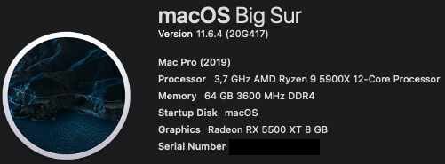
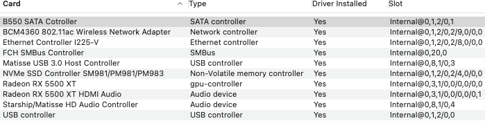
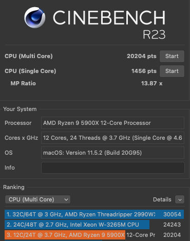

# ASRock-B550-Phantom-Gaming-ITX-Ryzen-5900X
 

  
 

 

  
 

  

  
 

   

  
 

 ## Specs
| **Component** | **Model** |
| ------------- | --------- |
| CPU | Ryzen 9 5900X |
| RAM | DDR4 64GB (2x32GB) 3600MHz |
| Audio Chipset | Realtek ALC1220. Works with layout-id 1 |
| dGPU | MSI RX5500XT 8GB. Works OOB with boot argument adgpmod=pikera |
| WiFi & Bluetooth | BCM94360NG Works OOB. Fits into original Intel card slot |
| Lan |  Intel® 2.5GbE LAN I225-V. Works OOB with boot argument dk.e1000=0 |
| OS Disk | 512GB Samsung 970 Pro NVMe |
| macOS | Big Sur 11.5.2/OpenCore 0.7.3 |

## BIOS
| **Setting** | **Value** |
| ------------- | --------- |
| Above 4G memory | Enabled |
| SATA Mode | AHCI Mode |
| Fast Boot | Disabled |

## USB config
USB Map was created manually. All ports are working.

## Issues
In order for 5GHz wifi band to work, AirportBrcmFixup.kext must be used.
In order for Reboot/Shutdown to work, HS10 USB port must be excluded from the USB map. It maps to internal LED Controller and prevents proper system Reboot/Shutdown.

## Apple TV+
In order for Apple TV+ to work I use boot arguments shikigva=80 unfairgva=1
