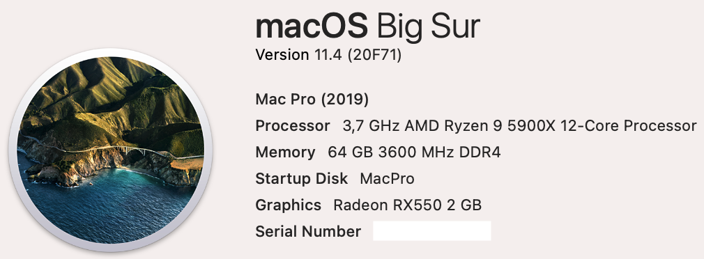

# ASRock-B550-Phantom-Gaming-ITX-Ryzen-5900X
 

  
 

 

  
 

  

  
 

 
 ## Specs
| **Component** | **Model** |
| ------------- | --------- |
| CPU | Ryzen 9 5900X |
| RAM | DDR4 64GB (2x32GB) 3600MHz |
| Audio Chipset | Realtek ALC1220. Works with layout-id 1 |
| dGPU | Sapphire RX550 2GB Lexa core. Works with device-id swap |
| WiFi & Bluetooth | BCM94360NG Works OOB. Fits into original Intel card slot |
| Lan |  Intel® 2.5GbE LAN I225-V |
| OS Disk | 512GB Samsung 970 Pro NVMe |
| macOS | Big Sur 11.4/OpenCore 0.7.0 |

## BIOS
| **Setting** | **Value** |
| ------------- | --------- |
| Above 4G memory | Enabled |
| SATA Mode | AHCI Mode |
| Fast Boot | Disabled |

## USB config
USB Map was created manually. All ports are working.

## Issues
Intel Ethernet I225-V card is not working properly. Changing device-id and using FakePCIID kexts does not work on this board. When ethernet cable is plugged in, APIPA address is assigned and system crashes. Currently I have not found a solution to this problem.